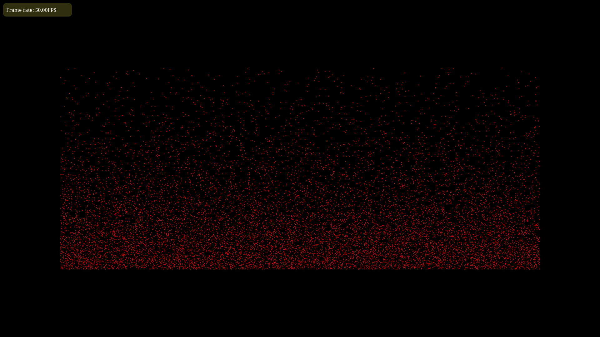

# Spatial Hashing

Try the demo here: [https://sam-martis.github.io/Spatial-Hashing_01/](https://sam-martis.github.io/Spatial-Hashing_01/)

Plain collision checker with gravity.

Space is divided into grids so that each particle must check its neighbouring particles for collisions

